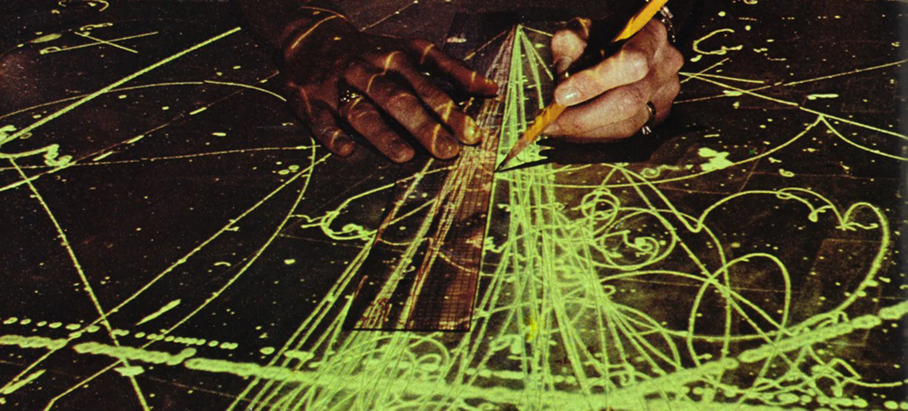
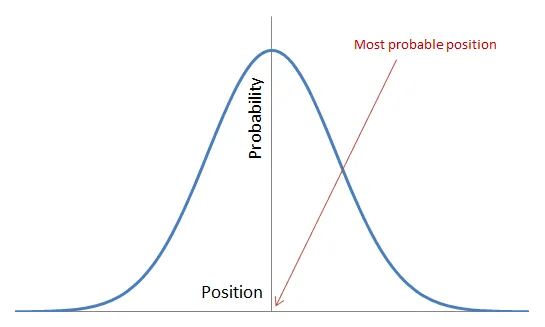
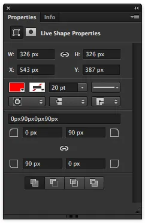
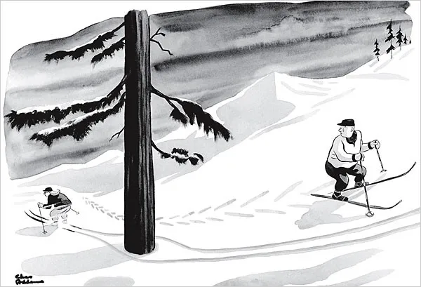
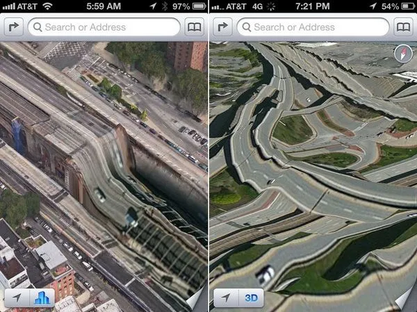

Quantum mechanics can describe a lot about UX including it’s freaky teleportation-esque phenomenon. Let’s science the shit out of this.

Physics isn’t my strong suit, especially the math. So don’t worry about big equations, intimidating notation or funky Greek letters. I like to joke that having a Computer Science degree technically makes me a scientist. In reality I’m a designer with an addiction to science. That’s led me to see some compelling parallels between the two, accuracy be damned.

### Release the Analogies
Let’s be honest with ourselves for a moment, we UX practitioners have no idea what the outcomes of our designs will be. No matter how experienced we become there is always a range of results. That range is vast too, from epic and spectacular fails to genius level innovation. Sure, we usually have a good idea what will happen but, in reality, we’re just guessing.

Call Hank Pym, it’s time to get tiny.

<Illustration>
    <template v-slot:image>

</template>
    <template v-slot:subtext>Careful in there, Hank</template>
</Illustration>

Think of reality at the quantum level. The stuff that atoms are made of. Neutrinos, quarks, electrons, photons, etc are all particles. At this minuscule scale reality gets weird. How weird, you might ask? Well, for instance, particles don’t exist within a single position in space and time. You can’t say that one exists at a specific x and y coordinate. Particles exist within a range of probabilities called it’s [wave function](https://en.wikipedia.org/wiki/Wave_function).

We can describe our designs as wave functions. We don’t know what the outcome (position) or effect (momentum) our designs will have. They exist within a range of probabilities. Of course, this is all before testing and validation.

<Illustration>
    <template v-slot:image>

</template>
    <template v-slot:subtext>
    
A simple wave function via [Louyah Fatoohi](http://www.louayfatoohi.com/2013/01/philosophy/presenting-ignorance-as-knowledge-the-standard-interpretation-of-quantum-mechanics/)
    
</template>
</Illustration>

See where I’m going with this?

When we talk about our designs we use a bunch of terms to describe it’s tangible and intangible properties. Things like height, width, transparency, flow, color, roundness and timing are all common examples. As we design experiences we are essentially assigning properties to various things. One could argue that a design is just a localized set of properties.

<Illustration>
    <template v-slot:image>

</template>
    <template v-slot:subtext>Proof of properties in the wild</template>
</Illustration>

In the quantum realm, [a particle](https://en.wikipedia.org/wiki/Particle_%28disambiguation%29) is a thing that has a bunch of properties that we can assign to it. Sounds like a design to me and a pretty tight parallel between the two fields. Physicists also use some fun terminology to name their properties. Describing the flavor or spin of our designs could liven things up.

### Duality of Design
We just described a design two different ways, probability and properties, but we see particles just like we see designs. How can they be both at the same time?

This quantum mechanics explains this conundrum as the [wave-particle duality](https://en.wikipedia.org/wiki/Wave%E2%80%93particle_duality). Neither description, by itself, can fully describe the behavior of quantum things. Albert Einstein, society’s beloved genius, has a great quote about this:

---

> It seems as though we must use sometimes the one theory and sometimes the other, while at times we may use either. We are faced with a new kind of difficulty. We have two contradictory pictures of reality; separately neither of them fully explains the phenomena of light, but together they do.

---

This is our experience design duality. We need both descriptions of an experience design to fully explain it.

Every designer has experienced this duality first hand. We design an experience, we’re really confident it’s going to work for certain users and use cases while we talk about how great it looks, smoothly it flows and how easy it is to use. We talk about it’s probabilities and it’s properties together to fully explain it. For most of us this happens daily.

### Where Does Testing Fit In All This?
So far we’ve only talked about unvalidated or untested designs. Only by validating can we see the results and measure our designs. Thus, validation squeezes probabilities giving us a more accurate picture of our designs.

By measuring a particle it’s wave function “collapses”. It’s probabilities narrow to a sharp, identifiable bump of a wave function. This reveals a more accurate position of the particle in space.

Whether your looking at a particle or a design you’re doing the same thing. Increasing the accuracy of it’s place in reality by reducing it’s range of probabilities.

### You Promised Teleportation!
To be honest I promised something like teleportation. Getting to the heart of this elaborate analogy requires all this set up. Unless you already see where I’m going with this.

[Quantum tunneling](https://en.wikipedia.org/wiki/Quantum_tunnelling) is the phenomenon where particles appear to travel through things. How can this be possible? A particle’s wave function has a non-zero probability of existing anywhere in the universe. The highest probability is at the peak of the wave function decreasing the further away you get from it. It nears infinity but never reaching zero. Let that sink in for a second.

Think of a particle in a quantum sized box. When the particle is close to a wall it’s wave function extends outside the box, past the wall. There’s a slightly higher probability that particle’s wave function will collapse on the opposite side of the wall. That little bit of probability is all it needs. One moment it’s in the box, the next moment it’s escaped.

<Illustration>
    <template v-slot:image>

</template>
    <template v-slot:subtext>Easier to go through than around</template>
</Illustration>

This phenomenon is sounds unreal but it’s mathematically proven, observed and harnessed. A bunch a super science-y tech and everyday things like [pressure sensors](https://en.wikipedia.org/wiki/Quantum_tunnelling_composite) are based off of it. It was even recently discovered that [water quantum tunnels though stuff](http://phys.org/news/2016-04-state-molecule.html).

Part of experience design that we all know and love are the barriers created by product requirements. Things like technical restrictions, user needs and business requirements all help define them. On one side are the minimum core requirements and must-haves. On the other are the nice-to-haves and stretch goals.

Every once in a while we’ll design an experience that shows up beyond these product barriers. Whether it fails to meet the bare requirements or transcends the nice-to-haves the outcome is outside the realm of anyone’s expectations. A breakthrough experience that probably seemed normal but ended up on the opposite side of it’s barriers.

Probably one of the more recent epic examples of an experience quantum tunneling itself to failure was the [iOS 6 version of Apple Maps](http://theamazingios6maps.tumblr.com/).

<Illustration>
    <template v-slot:image>

</template>
    <template v-slot:subtext>Apple Maps circa 2012</template>
</Illustration>

Viral videos are a perfect example of transcending expectation. Someone shoots an innocuous video and becomes an overnight sensation. The original “Old Spice Guy” commercial is a great case study. Designed to target females it appealed to just about everyone and went on to launch more products for the brand not to mention a cultural phenomenon.

<Illustration>
    <template v-slot:image>

</template>
    <template v-slot:subtext>You want to smell like Isaiah Mustafa</template>
</Illustration>

We don’t see transcendent experiences happening every day but science reliably harnesses quantum tunneling. Entrepreneurs try really hard and venture capitalists pour tons of money in to start-ups attempting to create breakthrough experiences. How do we reliably tunnel through our requirements?

It’s a numbers game. The number of subatomic particles is estimated to be so high that we should consider it nearly infinite. Just the number of baryons, one type of particle, in only the observable universe is [estimated at 10 to power of 80](http://physics.stackexchange.com/a/1635). That’s a lot. There definitely aren’t that many start-ups.

Instead, let’s consider the quantum tunneling of experience design a source of innovation. Peter Drucker laid out seven sources of innovation, this definitely fit with the first source: [The Unexpected](http://www.druckerinstitute.com/wp-content/uploads/2015/04/Drucker-on-Innovation-reading.pdf). It’s something we can’t plan for, strategize to or design against. It’s just naturally happens.

### Just Scratching the Surface
Looking at user experience through the lens of science reveals tons of compelling analogs. We could probably keep taking them further which would conjure up a lot of questions.

How would Heisenberg’s uncertainty principle apply to measuring our designs? Since physics describe the laws of nature and experience design can be described by physics is design a law of nature? What are the philosophical implications of quantifying experience design this way?

Deep questions for another time.

---

> A big thanks to [James Brush](https://medium.com/@jimbojones) for keeping my science in check. He’s a real physicist, I just play one on the internet.