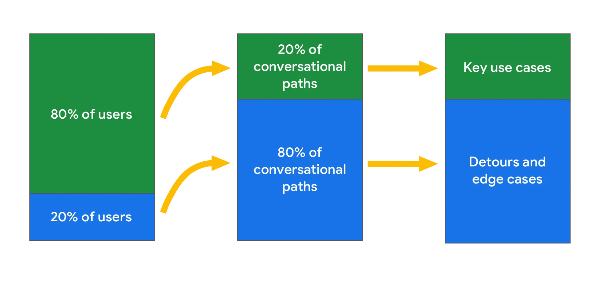

Years ago, I came across the concept that 80% of your users only use 20% of your design. This was on [Google’s Conversational Design guidelines](https://developers.google.com/assistant/conversation-design/design-for-the-long-tail), and at the time, I took it largely at face value:

> For conversation design, this rule is a way of saying that not all paths are created equal. 80% of users follow the most common 20% of possible paths in a dialog. Therefore, invest resources accordingly for the biggest impact.

This makes a lot of sense for conversation design. The vast majority of what’s possible in a conversational AI is obfuscated, hidden from users until they bump into it. I’d argue this is generally true for non-conversational products as well: different modality, same principle.

There are schools of thought suggesting that those 80% of use cases aren’t priorities, that they should only be “good enough”, or that they can be backlogged for phase 2. Let’s be honest — phase 2 never happens. Even Google’s guidelines say this:

> Similarly, there are trade-offs in terms of perfection or completeness. It may take 80% of the work to really polish the last 20% of the project. In these cases, the unpolished effort may be “good enough.”

The 20% of people that bump into an edge case are just as important as those who don’t. Every part of your design is important, it’s your responsibility to know why.

I’d argue that it’s more important to design for edge cases because that’s where expectations can be exceeded. It gives you more opportunities to delight, demonstrates that every user, no matter the use case, is important, and leaves people with a good overall experience.

Besides, we can’t control who has edge cases, who doesn’t, and when those edge cases happen. A good product is prepared to help someone get from point A to point B even when something goes wrong.