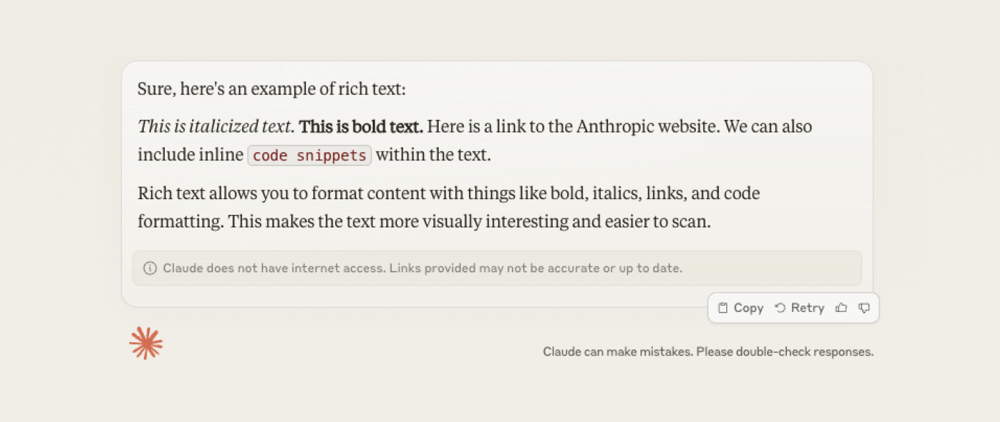
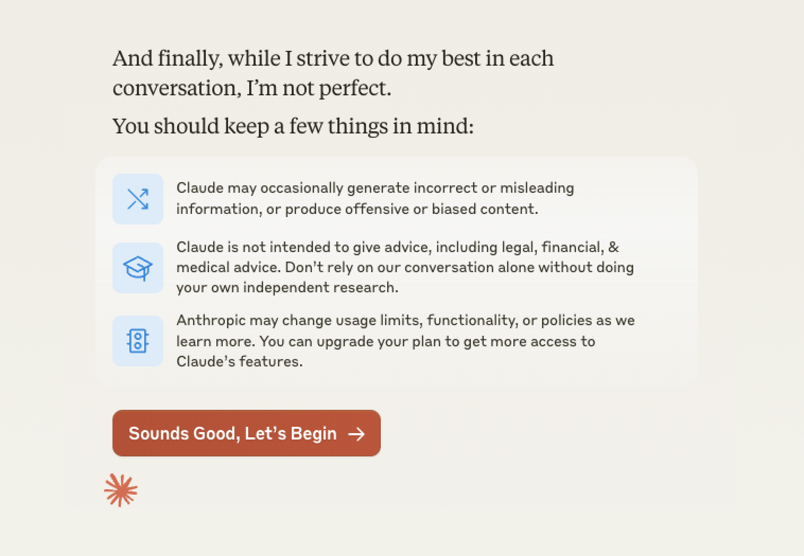

Designing an interface for an LLM is deceptively complex. You might be thinking: “Isn’t it just a boring, old chat UI?”. There are shared aspects, sure, but also it’s something completely different. It might even cause you to reframe how you approach design.

### What is an interface?
An interface is essentially a thing we humans use to interact with a computer. The interface is the layer between the person and a pile of circuits. Those circuits have a known set of features that the interface enables a person to use.

In this definition, there’s only one unknown: the user. We don’t know who’s using the interface or what they’re going to do with it. With research, we’d have a good idea but we ultimately don’t know. Product and UX design have become very good at designing in this paradigm, when the only unknown is the user. But what happens when we add an LLM to the equation?

### LLMs change the design paradigm
By this point, I’m assuming most of us understand that LLMs, and generative AI in general, are non-deterministic. Just like a human user, you don’t know what they’re going to do. When you design a product with an LLM in the mix, you’re now designing for two unknowns. The design paradigm changes and the primary purpose of your UI is to enable communication between the two unknowns — the user and the LLM.

This new paradigm is one of the challenges product teams face when building for LLMs, whether you’re working at Anthropic designing the interface for Claude or integrating with ChatGPT to build a conversational AI agent for your company.

### More than a chatbot UI
So how is this different from a chatbot UI? The primary difference is determinism. Chatbots are deterministic, LLMs are not. While chatbots use AI and ML for their NLP and NLU, their behaviors and responses are static and pre-designed — there’s little variability in what it will say and do. You know exactly when it will need to respond with text, an image, or a button. LLMs, however, are non-deterministic; you don’t know how it will behave or respond. Your goal is to predict what it will need.

## Approaching the problem
So, how do you design for this new paradigm? My approach is simple: treat your AI as another type of user.

### Your LLM is a user
There are a lot of similarities of the unknownness between a human user and an LLM when it comes to product design. Look at your product from your AIs perspective. Then run a design process focused on it just like you would a human user. Work to understand its needs, goals, contexts… all of it. Once you understand it as a user you can design the interface it needs to communicate with the human user.

In practice, you’re running two design efforts; one for your human users and one for your LLM.

### Designing for non-determinism
Regardless of what a user asks an LLM to do, the LLM ultimately determines what it will respond with and how it formats that response. That’s the nature of a nondeterministic system; no matter how predictable an LLM ability is, there is non-zero a chance of it responding with something unexpected. This means the interface needs to be loosely coupled and able to handle whatever your LLM with throw at it.

By treating your AI is a user, you’re defining a set of tools it can use to communicate with your human users through the interface. When your AI responds with something unexpected, unknown or emergent, your interface will be able to gracefully and dynamically handle it.

### Why loosely coupled?
It’s no big secret that LLMs consist of well known and little known features. There’s also ongoing debates about unknown features, so called emergent abilities. An emergent LLM ability has been defined as “not present in smaller models but is present in larger models” (Wei, et al 2022). Essentially, they’re things the model learned to do as it scaled and not something it was intentionally trained to do.

Like I said, there’s an ongoing debate whether LLMs actually show emergent abilities or whether it’s just an artifact of how models are tested and measured:

- https://www.wired.com/story/how-quickly-do-large-language-models-learn-unexpected-skills/
- https://www.quantamagazine.org/the-unpredictable-abilities-emerging-from-large-ai-models-20230316/
- https://cset.georgetown.edu/article/emergent-abilities-in-large-language-models-an-explainer/

No matter where you land on the debate, the point is these systems are so big and complex that you can’t know it all even if you’re one of the people training it. New behaviors and features you didn’t know about become surprises and feel emergent. To complicate things further, it’s a moving target; each new model has new features and behaves in different ways.

## Context is critical
The needs of your human users and your LLM aren’t mutually exclusive. They will influence each other. Arguably, the most important aspect is context; understanding where your human users are interacting with your AI. This will dictate how you design both the interface and the interactions.

### Modality dictates everything
Will your human users only be using this on desktop-sized web? Or maybe it’s also through SMS? Can they can do it through WhatsApp, Slack, or Microsoft Teams?

Each modality has a different set of capabilities and restrictions. SMS is probably the most restrictive. What happens if your AI responds to the user with a code block over SMS? Or a 1,000 word poem? Or 20 images of a home you want to tour? These all sound like terrible things to get over SMS.

Your AI needs to know the users modality and what kind of responses are available for that modality. This way it can tailor its behavior to the current modality and remain loosely coupled. For example, instead of sending that code block over SMS it could respond with a download link or send it in an email; features outside the bounds of an interface.

## Basic LLM interface features
Essentially, every LLM-based/conversational experience has the same basic needs. I’ve listed some of them out here to help kickstart your efforts, assuming you’re building a conversational interface. This isn’t an exhaustive list, but definitely a good place to start so you’re not reinventing the wheel:

- Plain text
- Rich text
- Pre-formatted content
- Emojis
- Code blocks
- Images
- Buttons

### Plain Text
The most foundational are blocks of plain text. The interface should be able to take plain text from the AI, format it and display it to the human user without any issues.

### Rich Text
Next would be formatted text, or rich text. Thing like lists and titles, bold and italics, and links. The interface should be able to take a response with rich text from the AI, format it to fit the design system and display it to the human user without any issues.

### Pre-formatted Content
There are likely scenarios where the content your LLM serves up is pre-designed and deterministic (e.g., not nondeterministic). This is likely something that lives in the interface and simply gets triggered by the LLM. Regardless, you’ll need to account for pre-designed, deterministic content.

### Emojis
Emojis and emoticons seem like table stakes, but they do warrant their own considerations. Your interface needs to be able to display emojis that your AI responds with, otherwise your human users are liable to see those empty square boxes sprinkled throughout their conversation.

### Code
LLMs spitting out code is one of their big value props. It’s all just text but your interface should handle blocks of code coming from your AI differently so that it’s formatted in a way that easy to use and obviously different from the other types of text. One of the tricks is reliably knowing the start and end of a code block in a response.

### Images
Next up the spicy ladder of complexity is images. An image is just an encoded string of text. If the interface can’t handle images from your AI, then your human users might just see a massive block of gibberish text.

Have you thought about what if your AI responds with multiple images? Imagine talking with a real estate AI and it only sends you one image of a house a time. Not a great experience. Your interface should be able to handle responses with multiple images.

### Buttons
Buttons are important for conversational experiences and your interface should be able to handle them. They’re everywhere in the old NLU-based chatbot world in large part because they’re really effective when used judiciously. Besides, you don’t know if or when your AI will respond with a button so your interface should be prepared to accommodate them.

If that hasn’t convinced you, then keep in mind there are certain situations where a button is either legally required or needed to limit liability, for instance, accepting Terms & Conditions or a Privacy Policy.

## More complex features
Depending on how complex you want to go, what your human users are doing, and how specialized your making your AI; there’s really no end to the types of features you’d need to make available in your interface. Videos, charts & graphs, calendars, spreadsheets, screenplays, essays, resumes, maps, input fields… the list goes on.

### Input fields
This might seem weird in a conversational or chat experience, but using input fields to collect specific pieces of data can be really effective.

### Side panels
Not everything in a conversational experience has to be presented linearly. ChatGPT puts everything in one giant chat bubble no matter how long it is. While that works for shorter responses, longer responses quickly become overwhelming. Something Claude does is put longer, contained responses in a side panel creating a nice separation between the thread of the conversation vs. the artifacts it’s producing.

## Things not covered
There are lots of other features that you’ll need to implement in your interface to run a healthy, mature LLM-powered product. Things like response rating (thumbs up / thumbs down), post chat survey, timestamps, avatars, transcripts, metrics, etc. They’re critical for a well-rounded product. However, they’re not required for an interface to enable conversational communication between an AI and a human user.

## Into the future
This whole field is changing at a break-neck pace. As generative AI, especially LLMs, evolve the interfaces they and we need to interact with each other need to evolve at a similar pace. One thing I think this challenges is the long product development processes teams rely on. Designing for an LLM as a user provides this great hidden benefit; a way of future-proofing. It can help bridge the gap between the evolution of LLM models’ abilities and product team’s release cycles.