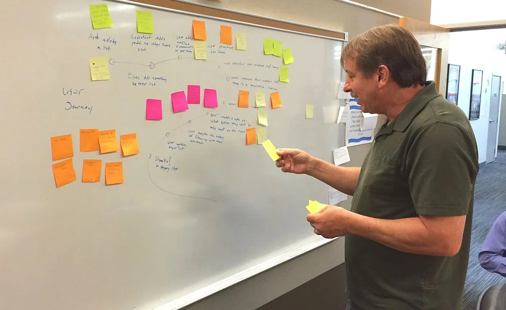

UX designers are always designing around user flows and user journeys. Or they need to define new ones. Traditionally you would do a bunch of discovery, diagram it out, validate it and iterate until it’s accepted. That way is time consuming and your stakeholders question why you’re spending their money not designing.

There is a better way. This is a tool that I’ve used to it quickly and collaboratively. It’s not perfect and I’m always refining it but it’s been really successful.

## Step 1: Gather Your Party
Get a cross-disciplines group together. It’s important to have a smattering of engineers, users and SME’s together in this workshop.

There are two keys to the success of this workshop:

The first key is providing a great space. Somewhere these different people can candidly collaborate and communicate with each other.
The second key is the structure. Stick to the workshop structure and set time limits for each activity.
Step 2: Define The Goal
You’re designing a solution, but for what purpose? Define what the journey is trying to accomplish. Write it on the whiteboard and keep it up there for the entire workshop.

Always refer to this goal during the workshop. It will help keep everyone, including you, on track.

Don’t be afraid to revise it mid-workshop. Sometimes the group doesn’t realize what the goal is until they start solving it.

## Step 3: Navigate The S-Curve
Draw a big “s”. This represents your primary journey. This will be the happy path. Your users’ story. Keep it front and center on the whiteboard the entire time.

### Pushing Off
Where does the journey start? Most people have clear idea. Draw a small circle at the beginning of the curve and label it.

Where does the journey end? This is usually a big hard to articulate. This is usually where the stakeholders in the room chime in the most. When you’re writing a story you should start with the end. It’s important to define what a successful end to the journey is before tackling the in-between steps.

### The Journey
Fill in all the steps between the start and the end. Start by walking through each in-between step. This is where the SME’s and users shine. Answering the question “how do we get from point A to point B?” Or better yet “how do we want to get from point A to point B?”

In my experience there are two ways this activity plays out:

1. Everyone is crystal clear about what the process is or will be and there is little discussion about it
2. The first couple of steps are easy then it becomes an ad hoc, wild west of ideas, “what if’s” and “oh, I didn’t know you did that”.

### Focus
Keep people thinking about the primary journey. There will always be edge-cases and situations that require branching. Focus on the 90%, that’s what this workshop is all about. What is the journey that will happen 90% of the time. Look at the road in front of you.

## Step 4: How Might We
Now you’ve defined your primary journey. But that’s not the end of the workshop. Just defining a journey is only part of the work. You still need to solve for it.

Ask the question “How might we enable this journey? What things can we make or do?”

Set a timer for 5 minutes. Instruct everyone to write ideas on sticky notes, one idea per sticky, and put them on the whiteboard.

At the end of 5 minutes walk through each sticky. The person who wrote it should naturally provide an explanation for it, prompt them if they don’t. Add notes, group or organize as you and the group see fit.

Avoid doing anything that resembles planning like making a “parking lot” group of stickies.

## Step 5: Next Steps
Take photos of your board and write down any notes of important things discussed or overheard. Transcribe all of it, nicely formatted, and send it to everyone who participated. Standard UX professionalism.

Now that your workshop was a rousing success you’re product owner asks “what’s next?” You have a journey you can design for and lots of ideas around how to make it happen. It’s up to you and your PO to plan and prioritize how you’re going to design and validate.

## Tips & Tricks
Ideally this kind of workshop should be doable in 30 minutes. If it lasts for more than an hour then the group has probably gone off track or the goal is too complex. In either case end the workshop and regroup.

If the goal is too complex then your next step should be to simplify it. Either through refinement or breaking it up into smaller goals.

Remember than you are the facilitator. The group needs to be speaking the most and generating the 90% of the ideas. Frame your ideas, opinions or contributions as questions. Let the collaborators accept or deny them.

Always refer back to your goal. Especially if a discussion starts going too long or there is confusion. Ask “how does this accomplish our goal of…” Since they defined the goal it’s amazing how quickly they realize how off track they were taking everyone.

You need to lead by example. At the beginning of each activity start by voicing your thoughts. For example, after drawing the s-curve tell the group what you think the start and end points might be.

This tool is always in my back pocket. It’s not always useful or appropriate depending on who your workshop attendees would be. I’ve had a lot of success with it. You can get a lot of great information quickly, stuff that would have taken much longer to get to with other discovery methods.

People generally love collaborating like this. I’ve not run a single workshop where people didn’t walk away feeling better. The happiness factor can be the most valuable outcome.