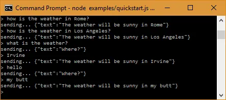

They haven’t “crossed the chasm” yet but it was past due to awaken my very own Frankenstein’s Monster of a chatbot. With tons of free and approachable tools available there’s no reason not to.

Chatbots have a ton of potential. There seems to be a growing stigma in some emerging tech circles that they’re a tired old hat by now or just a cute toy to play with. But that’s not dissuading me.

Chatting is a far more natural way for us humans to interact with a soulless digital system. Much more so than clicking around a meticulously designed visual interface. Our traditional interaction methods are still rudimentary, they haven’t really changed since the dawn of the mouse.

Where was I to start? Luckily there’s a huge chatbot community on Medium. This [article on Chatbots Magazine](https://chatbotsmagazine.com/the-complete-beginner-s-guide-to-chatbots-8280b7b906ca#.bny2xvgxq) is a great resource for getting your feet wet.

Creating any old chatbot wouldn’t do. This wasn’t going to be some simple data in — data out, prompt-and-response affair. My creation needs sophistication, personality, layers and above all it needs to converse. To make this happen I needed a platform that can support Natural Language Processing (NLP), Machine Learning (ML) and custom code.

[Wit.ai](https://wit.ai/) seemed to fit the bill. They were acquired by Facebook so it’s a good bet they have something worthwhile. Their website and bot building tools seemed friendly and approachable enough, not to mention a definite Facebook vibe.

So, I signed up. This was my first chatbot, I had no idea what I was doing. Following their [5 Minute Quickstart](https://wit.ai/docs/quickstart) seemed like the best next step. I dove in.

After about thirty minutes of tinkering and following instructions I was ready to have my mind blown. I opened a trusty command prompt and asked my bot how the weather was…

Not sure it’s weather source is trustworthy. Either that or the Internet of Things has truly become u-butt-quitous. Puns totally intended.

You can’t hold a conversation with it yet but at least it’s awake. The quickstart was true to its word. I‘m naming it Barnard after [Barnard’s Star](https://en.wikipedia.org/wiki/Barnard%27s_Star), one of the most studied red dwarfs.

Barnard the chatbot is a launch pad. From here it can take any shape and learn to interact. Perhaps collaborating on guitar riffs. Or maybe providing status reports to the higher-ups. There are so many possibilities.

Teaching it “hello” seems like a good start.