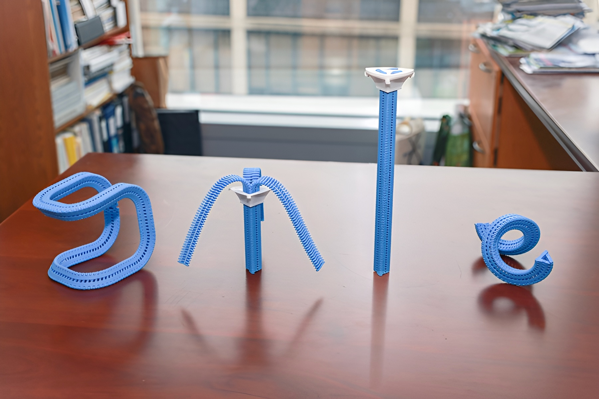

*[More Infinite](https://moreinfinite.substack.com) is a series about the innovations quietly making the future better.*

We spend a lot of time talking about software getting smarter. AI, agents, large language models — the discourse is wall-to-wall. Meanwhile, something quieter and arguably weirder is happening in materials science. The actual physical stuff we build things out of is starting to behave in ways that would've sounded like science fiction ten years ago.

Not metaphorically smarter. Literally. Materials that heal themselves. Plastics with dormant bacteria baked in, waiting for a signal to dissolve the whole thing from the inside out. A zipper that turns a floppy strip of plastic into a load-bearing structural beam on demand.

We're in the middle of a shift in how we think about physical objects — from things that wear out and get replaced, to things that adapt, repair, and eventually disappear on purpose.

Here's what caught my eye recently.

---

## A zipper that rewrites what a material can be

MIT's CSAIL just published research on something called a Y-Zipper, and it's one of those ideas that makes you wonder why it took this long. The concept actually originated in 1985 — a young engineer at Polaroid named William Freeman submitted it to a design competition in Scientific American. The judges passed on it. Freeman is now a professor at MIT, and he finally got to build the thing properly.

The Y-Zipper is a three-sided zipper, 3D-printed, that can transform a completely floppy strip of plastic into a rigid structural beam in seconds, and back again. The principle isn't complicated: triangles are inherently rigid (it's why bridges and cranes are built the way they are — a triangular truss resists deformation in a way a rectangle just can't). The Y-Zipper applies that geometry on demand, by forcing three flexible arms into a triangular configuration as you zip.

In testing, one survived 18,000 open-and-close cycles before failure.

**The bigger picture:** Right now, we design objects for one state — either flexible or rigid — and that's what they are forever. The Y-Zipper opens up a different question: what if the same material could be both, on demand? Deployable shelters that pack flat and snap rigid on site. Robotic limbs that go soft for safety and hard for strength. Medical devices that reconfigure without a surgeon.

→ [MIT CSAIL: It Took 40 Years for Technology to Catch Up to This Zipper Design](https://www.csail.mit.edu/news/it-took-40-years-technology-catch-zipper-design)

*Also: [TechRadar](https://www.techradar.com/tech/3d-printed-y-zipper-turns-from-flexible-to-hard-in-less-time-than-it-takes-to-zip-your-fly) · [Tom's Hardware](https://www.tomshardware.com/3d-printing/mit-researchers-revive-40-year-old-triangular-zipper-concept-now-made-possible-by-3d-printing-creates-shape-shifting-robots-and-deployable-structures-3d-printed-y-zipper-turns-floppy-tentacles-into-rigid-beams-in-seconds) · [VoxelMatters](https://www.voxelmatters.com/mit-csail-brings-40-year-old-zipper-concept-to-life-with-3d-printing/) · [New Atlas](https://newatlas.com/materials/y-zipper-flexible-rigid/) · [Heise Online](https://www.heise.de/en/news/From-soft-to-rigid-Y-zipper-enables-change-in-object-stiffness-11281562.html) · [ACM paper](https://dl.acm.org/doi/10.1145/3772318.3790723)*

---

## Plastic with a built-in expiration date

Here's a framing I hadn't thought about before: the durability of plastic isn't a feature, it's a bug, at least for short-lived applications like packaging. We engineer something to last for centuries and then use it for a few minutes.

A team at the Shenzhen Institute of Synthetic Biology took that question seriously: what if you built the degradation directly into the material's life cycle?

What they created is a plastic film embedded with dormant bacterial spores (think of spores like seeds — a survival mode bacteria can enter, staying inert until conditions are right to wake up) — specifically two engineered strains of *Bacillus subtilis* that sit inactive during normal use. When you're ready to dispose of it, you expose it to a warm nutrient solution and the spores wake up and break down the polymer chains (polymer is just the scientific name for the long molecular chains that give plastics their structure), and the entire thing is gone in six days. No microplastics. Down to its base molecular components.

There are real limitations still — it requires a specific trigger, not ambient conditions, and it was demonstrated on polycaprolactone (a biodegradable plastic common in 3D printing and dissolvable surgical sutures) rather than the polyethylene or PET found in most consumer packaging.

**The bigger picture:** Developing a water-based trigger is the obvious next frontier, which the researchers flagged as their next direction. That's when this gets really interesting for ocean plastic. But even before that, the concept inverts the logic of how we design disposable materials. Instead of engineering plastic to last and hoping it degrades someday, you build the ending in from the start.

→ [ACS: This 'Living Plastic' Activates and Self-Destructs on Command](https://www.acs.org/pressroom/presspacs/2026/april/this-living-plastic-activates-and-self-destructs-on-command.html)

*Also: [New Atlas](https://newatlas.com/materials/living-plastic-breaks-down-on-command/) · [Phys.org](https://phys.org/news/2026-04-plastic-destructs.html) · [ZME Science](https://www.zmescience.com/science/news-science/scientists-create-living-plastic-that-can-self-destruct-on-command/) · [TechSpot](https://www.techspot.com/news/112317-scientists-create-living-plastic-can-self-destruct-command.html) · [Technology Networks](https://www.technologynetworks.com/applied-sciences/news/degradable-living-plastic-activates-and-self-destructs-on-command-412508) · [ScienceBlog](https://scienceblog.com/living-plastic-can-self-destruct-on-command/) · [Interesting Engineering](https://interestingengineering.com/science/plastic-destructs-on-command)*

---

## Composite materials that last centuries, not decades

Fiber-reinforced polymer composites — think fancy fiberglass, the stuff in racing cars, boat hulls, and wind turbine blades — have been holding together aircraft and spacecraft since the 1930s. Lightweight, strong, and basically everywhere. They've also always had a weak spot: delamination (when internal layers begin to separate, like plywood splitting apart from the inside; once it starts, structural integrity drops fast). Typical lifespan: 15 to 40 years.

Engineers at NC State and the University of Houston just published something that changes that math. They developed a composite that can autonomously repair delamination damage more than 1,000 times — not just resist it, but actually heal it, repeatedly, without disassembly. Their estimates put the functional lifespan at up to 500 years with annual healing cycles.

To be clear, this still needs real-world validation before anyone's promising 500-year aircraft. But 1,000 fracture-and-heal cycles over 40 continuous days in a lab is real evidence.

**The bigger picture:** Modern clean energy infrastructure, wind turbines especially, leans heavily on fiber composites that are hard to repair and nearly impossible to recycle, so they get replaced instead of fixed. Blades from decommissioned turbines are being buried in landfills right now. A material that can heal itself for centuries doesn't just cut costs; it changes the sustainability math on the clean energy transition.

→ [NC State: Self-Healing Composite Can Make Airplane, Automobile and Spacecraft Components Last for Centuries](https://news.ncsu.edu/2026/01/healing-composite-lasts-centuries/)

*Also: [Newsweek](https://www.newsweek.com/self-healing-material-could-extend-life-planes-cars-centuries-11833122) · [TechSpot](https://www.techspot.com/news/112095-new-self-healing-material-can-repair-itself-over.html) · [SlashGear](https://www.slashgear.com/2166730/self-repairing-material-emaa-cars-planes/) · [TechXplore](https://techxplore.com/news/2026-01-composite-airplane-automobile-spacecraft-components.html) · [Textile Tech Source](https://textiletechsource.com/2026/02/09/composite-can-repair-itself-1000-times/)*

---

## Also worth knowing

**Graphene as a superbug killer.** KAIST researchers figured out exactly how graphene oxide (think molecular chicken-wire: a single-atom-thick carbon mesh with oxygen atoms that lets it interact with biological materials) selectively destroys bacterial cell membranes while leaving human cells untouched. It targets a specific lipid found only in bacteria, essentially a molecular lock-and-key. It works against antibiotic-resistant strains, accelerates wound healing, and survives repeated washing. There's already a graphene toothbrush on the market with 10 million units sold.

**The bigger picture:** Antibiotic resistance is on track to kill 10 million people per year by 2050 — and bacteria are very good at evolving around chemical antibiotics. Graphene oxide works mechanically, physically tearing apart bacterial membranes, which means resistance is much harder to develop. A material that kills by physics rather than chemistry is one bacteria can't learn to dodge.

→ [Phys.org](https://phys.org/news/2026-03-graphene-oxide-bacteria-human-cells.html)

*Also: [EurekAlert](https://www.eurekalert.org/news-releases/1121503) · [ScienceDaily](https://www.sciencedaily.com/releases/2026/04/260424233210.htm) · [Industry Tap](https://www.industrytap.com/new-graphene-material-kills-deadly-bacteria-but-leaves-human-cells-safe/80330) · [Hospimedica](https://www.hospimedica.com/critical-care/articles/294810021/graphene-based-material-selectively-eliminates-bacteria-while-sparing-human-cells.html)*

---

There's a theme running through all of this: we're rethinking the relationship between materials and time. Things that heal instead of degrade. Things that change state on command instead of staying fixed. Things that disappear on purpose instead of persisting forever.

That's not incremental improvement. That's a different way of thinking about what physical objects are for.

---

That's it for now! Let me know what you think and what you'd like to see in future editions.

To boldly go,

✌️ Jason

