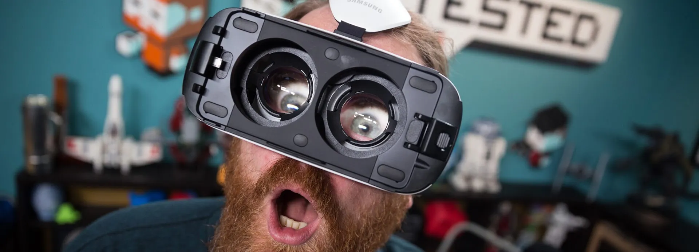
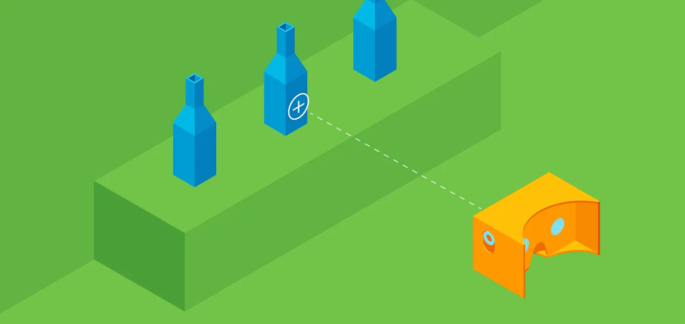
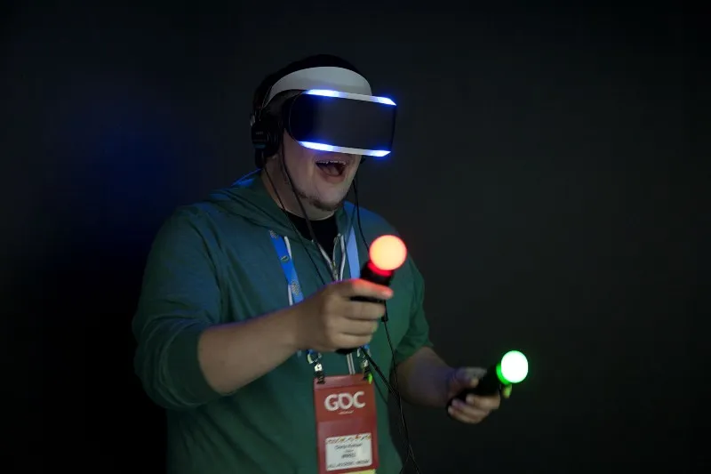
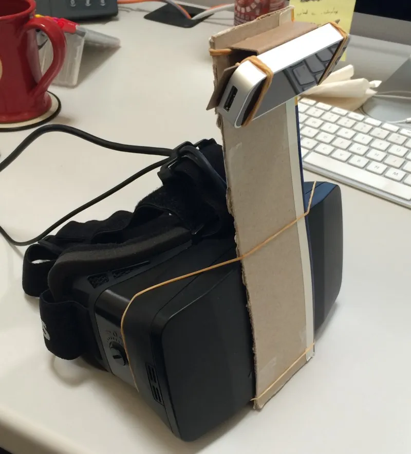
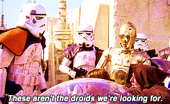

Virtual Reality, by it’s very nature, is an immersive experience. However, the state of VR technology currently being released to the public is barely more immersive than holding our smartphones uncomfortably close to our eyes. We’re only immersing two of our senses, sight and sound. VR needs to level up before it can be truly appreciated as an immersive experience. Our next challenge is immersive interaction.

Based on what I’ve seen from VR and where I see and hear it going, I’d like to put forth some rough definitions of the different levels of interactive immersion.

## Level One: None
This level is self explanatory. There is no interaction, the experience is purely about consuming the virtual reality content. Essentially you are placed in a VR experience and taken for a ride. At most you can look around your virtual self and ponder the existentialism of experiencing one world while physically occupying another one.

## Level Two: Gaze
Interacting with things in VR by looking at them is Gaze interaction. This builds upon level one and is the low-hanging fruit of VR interaction, it’s also used in the majority of experiences I’ve seen. Since this level of interaction doesn’t require a lot of computing power or additional input devices it has become common place for mobile VR experiences.

Gazing, however, is slow and unwieldy. It forces you to concentrate on what you’re “clicking on” and, in doing so, restricts your physical movement. This is a textbook bad experience.

## Level Three: Device-assisted
Holding something in one, or both, of your hands to interact in VR is called device-assisted interaction. This is becoming a hot market, there are quite a few different companies popping up to make these input devices. For instance, Playstation VR uses the their wizard wands.

We’ll probably see this level of interaction for a couple of years once Head Mounted Displays (HMD’s) are released and become more common.

Apart from looking silly, these devices also typically require infrared (IR) cameras, or some other devices, be set up severely limiting where you can experience VR. Since they’re typically made for gaming they are alien and unnatural to non-gamers to use. The need for interactive devices is a compounding problem creating a high learning curve and a high price point. IR cameras require line of sight to work and aren’t precision sensors, user input is laggy and unreliable making for an awkward experience at best.

## Level Four: Unassisted
This level of interaction is more natural because your HMD would track all of your body movements without the aid of additional devices or sensors. We aren’t yet technologically ready for this level. As part of an R&D project, back in Oct 2014, I jury-rigged a Leap Motion and an Oculus HD prototype.

This humble little set up was an epic crash and burn. The Leap Motion was unreliable enough stationary, on a desk, like it was designed for. Once attached to an HMD it didn’t stand a chance.

The main problem with this level of interaction, and with all previous levels, is that you still get a feeling of disconnection in VR. You still need to concentrate to interact with stuff because you don’t have any sort of physical feedback to where you’re hands really are or if you’re really touching something (like a button). Even though you’re interacting without any device assistance it’s still not an ideal experience.

## Level Five: Feedback
Imagine for a moment that you’re in a VR world, you reach out towards a tree and you feel the rough contours of the bark on your hands. Perhaps your moving down a road, a breeze picks up over your right and you “feel” the push and the coolness of the wind on the right side of your body. That’s the essence of the feedback level. You feel direct, real-time, physical feedback from the things you touch in VR. This enables you to concentrate less on trying to interact with things and leverage your natural sense of touch.

This level of interaction is clearly a long way off. However, a good starting point could be the use of [electroactive polymers](https://en.wikipedia.org/wiki/Electroactive_polymers). Think of [Batman’s cape](http://mad-science.wonderhowto.com/inspiration/bat-science-realistic-are-batmans-gadgets-dark-knight-rises-0138210/) from Christopher Nolan’s Batman trilogy, they called it memory cloth.

## Level Six: Speed of Thought
Interacting at the speed of thought is the dream and has been the dream for interacting with computers in general. Imagine being in a VR experience, thinking of where you want to go next and BAM you’re there. Maybe you imagine a skyscraper and it suddenly starts building itself out of nothing. Essentially you would have The Force sans the mind tricks.

This might not seem as far fetched as it sounds. With an HMD you already have something strapped around your brain briefcase. If its straps had an integrated [Brain-Computer Interface (BCI)](https://en.wikipedia.org/wiki/Brain%E2%80%93computer_interface) we could be one step closer to the dream of interactivity at the speed of thought.

Conclusion
Even though VR has been a [concept for 80 years](https://en.wikipedia.org/wiki/Virtual_reality#History) our technology is finally advanced enough to make it real. We are only scratching the surface of how immersive and interactive we can make it. Perhaps we can measure and judge our progress of immersive interactive “goodness” by these six levels as we continue turning science fiction into reality.