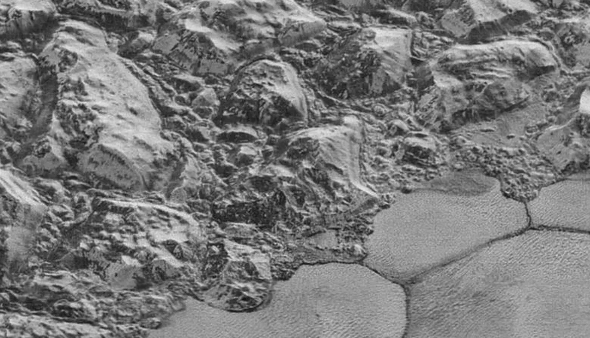

NASA is releasing the [highest resolution images it has of Pluto](http://www.nasa.gov/feature/new-horizons-returns-first-of-the-best-images-of-pluto/). That might not seem that important but it’s huge.

Five billion miles. That’s roughly the distance between us and Pluto. That is such a great distance that our brains can barely comprehend just how far that is. A couple hundred miles is long distance for most of us, sometimes even a couple of miles can seem like a world away. How do we begin to grasp five billion? We built an unmanned spacecraft that traveled that distance then sent images back across that same distance. Images of a distant, alien world is the stuff of science fiction. Humans flung a box full of electronics into space, waited ten years and it still worked. As a global society we’re turning science fiction into science fact. That is amazing.

These are the last images we’ll see of Pluto. At a minimum it will be decades before humans will see new images of this lonely planet. There is not a person alive today that will set foot on Pluto or possibly even see it with their own eyes, up close and personal. The next time we go will require a decade of planning, creation of fantastic new technologies, herculean coordination between multiple governments & organizations, years of space travel and mountains of cash. Given the direction of our society many people might say that doing something like this again is impossible.

The Universe is impossibly vast, we are less than a speck within it. These photos of Pluto reaffirms that there is more to life than Earth. We can work together, reach other worlds and achieve the impossible. We should always [strive for space and exploration](http://planetary.org/) regardless of how impossible it might seem. We can move our society into the future. Pluto proves that.