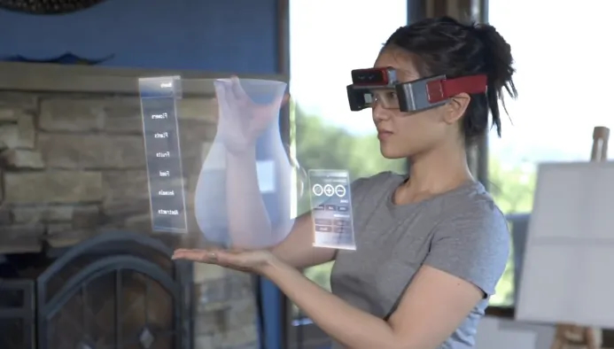

Mixed Reality is the next big experience technology but there are no tools for experience designers. The design community has just recently been breaking into VR in a big way. We’re seeing steady stream of early tools and techniques emerging, but just for VR. To really push mixed reality out of the labs and into the streets designers need to sink their teeth into it. For that they need tools.

The ideal mixed reality prototyping tool chain needs to be quick, effortless and have a super low learning curve. Being an experience architect and having developed 3D and AR engines I understand the complexities from both sides. So here are my thoughts on what the first mixed reality tool the experience design community needs.

## Rapid Preview / Testing
Just like when a developer hits build in their IDE to make sure their code works, designers need to quickly move from design software to a preview make sure their design works. This sort of rapid desk testing will be key.

## Hide The Tool Chain
The focus is on the design and the experience that emerges, keep the tools out of the way. There shouldn’t be a need to jump through multiple tools or manage background processes. The tool should be self contained. If it does have dependencies it should be auto-manage them or handle them some graceful way. The last thing someone wants to do is spend hours troubleshooting what thing broke in their tool chain, or why, just to preview something.

## Integrate With Current 2D Design Tools
There’s the hard-line stance of “just learn Unity or SketchUp”. However, the majority of designers work and think in two dimensions. Designing in three dimensions, learning new tools and workflows is incredibly expensive and time consuming. Especially if you’re just dipping your toes in to see if want to do this type of design. The ideal MR prototyping tool needs to seamlessly integrate with what designers already know, like Sketch.

## MR-specific Device Not Required
Access to a Hololens, Meta2 or other mixed reality device shouldn’t be the hurdle to creating mixed reality experiences. The ideal tool should be able to use widely available devices, like smartphones. Yes, MR experiences are different between, for example, a Hololens and an iPhone. Being able to rapidly test on a iPhone before moving to a Hololens is still extremely valuable.

## Utilize The Device Camera
This is the one thing that none of the VR prototyping tools enable, yet. If you can test on a phone then enable the camera and pass the feed through to the preview. It’s not perfect but it at least get’s the designer one step closer to the actual experience.

## Simulate User Interactions
Mixed reality experiences need interactions because people want to touch what they see. When your prototyping you need the ability to simulate all sorts of interactions: touch, gestures, etc.

## Simulate Context
The heart of all mixed reality experiences is it’s context. Where, when, what does it see, what does the user see, is the mixed part of the reality blocking a critical or dangerous part actual reality? The MR prototyping tool needs to have a robust way of simulating different contexts. The designer and developer won’t always be able to create in the context the experience will be used to do rapid desk testing. For instance, if the MR experience is for fire fighters you won’t find designers on their laptop in the middle of a burning building. Maybe metaphorically, but not literally. The tool needs to support that.

## Simulate Real-World Object Mixing
Mixed reality is all about mixing real world objects with digital artifacts. So of course the tool needs to do that. Since it’s a prototyping tool it probably shouldn’t be as robust as a production application. QR-style tracking markers or limited 3D pattern recognition should suffice. It would also allow for lots of flexibility and creativity with testing.

Imagine an MR experience where real world cars turn into palm trees. Stick 2D markers to a bunch of cardboard cut-outs then your co-workers can play bumper cars when you test.

## Let’s Make This Happen
This sounds like an exhaustive list and there are probably plethora of other features that designers would want. I think this list is a great start and I can already see it forming in my minds-eye. Hopefully the design community sees something like this emerge in the near future.