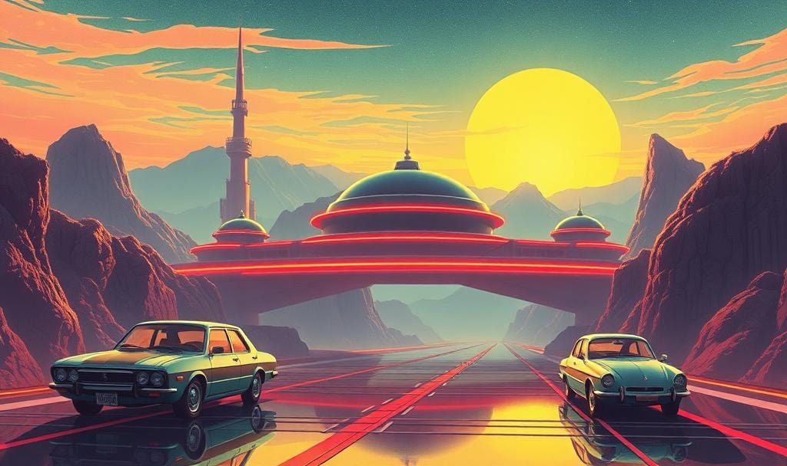

It’s easy to half-joke about being tired of living in unprecedented times. Everyday seems like a flood of increasingly dire news.

It’s also easy to forget that there have been massive leaps in technology and society. Unprecedented advancements that are exactly what the futurists of the 1950s and 60s were dreaming about. A sort of idyllic future that’s been imbued in our psyches. I’d argue we’re already there. Technologically at least.

I’d like take a minute to surface some of these achievements and testaments to human ingenuity.

## Jetpacks

A future where we all have jetpacks is an iconic retrofuturist dream. Just imagine waking up in your idyllic home, grabbing a cup of coffee, putting on your jetpack and zipping directly up to your office on the 205th floor in a metropolis of mega-skyscrapers.

What’s wild is we have jetpacks now. While they might not yet be as pervasive as those futurists dreamed of, they are being used daily for things like search and rescue.

<Video src="https://www.youtube.com/embed/gtvCnZqZnxc"></Video>

Also, there’s jetpack racing. Because why fly if you can’t have fun with it?

<Video src="https://www.youtube.com/embed/Jn5W19sdyf4"></Video>

## Exploring other planets

Being on other planets is a sci-fi staple and another keystone retrofuturist dream. While we might not be living or setting foot on other planets just yet, we’ve still been roaming around Mars for almost 30 years. Not just landing on another planet, but actually exploring it.

<Video src="https://www.youtube.com/embed/coZ83RM1jbk"></Video>

## Free Energy

Free energy has been a dream for many for a long time. Energy that doesn’t pollute and costs nothing to produce. It’s one of those things that could unlock the next phase of society, because everything in our daily lives needs energy. While we’re not there quite yet, we’re definitely closer than we’ve ever been.

Renewable energy is the only practical path to achieving this right now. While it’s a political and wicked problem to transition to renewables, there have been major successes. For example, at the end of 2023 the European Union reported that 45.3% of all the electricity produced in the EU came from renewables. In the United States, renewables produced 20% of all electricity generated in 2022; renewables produced more electricity than coal.

Fusion has been the pipe dream for free energy. It’s basically a chain reaction that produces more energy than what was put in to it. The running joke has been that it’s always “10 years away”. Over the past few years teams across the globe have been making exciting advances achieving more an more net energy gain. Not enough to make it viable yet, but enough to see billions of dollars being poured into research and planning commercial facilities.

<Video src="https://www.youtube.com/embed/0fYiNVRmOA4"></Video>

## Self-driving cars

This is already here. No doubt you’ve already heard of it unless you just don’t read the news. Waymo’s driverless taxis and Tesla’s full self-driving (FSD) are just a couple examples of what’s available right now.

Pushing a button and being driven to work, school, or the grocery store is something even Walt Disney dreamed of as an important part of daily life.

<Video src="https://www.youtube.com/embed/0fYiNVRmOA4"></Video>

## Robots in your house

Yet another staple of retrofuturists and sci-fi: fully autonomous robots. Robotics have been an essential part of the world economy. However, they’ve been limited to purpose-built, industrial applications like assembling cars, soldering microchips, or picking & sorting in warehouses. We’ve now reaching the point where robotics are capable of being autonomous and doing more squishy, daily human-life things like folding laundry.

<Video src="https://www.youtube.com/embed/Jvaor-g1dBI"></Video>

## There’s so much more

Flying cars, lasers, gene editing, interstellar spacecraft, AIs… the list goes on. It might seem like the world is on fire, and in some areas it literally is, but there is a lot of positive advancement happening that doesn’t get celebrated or covered as widely.

We’re bringing to life things that were once thought outlandish, impossible, and the realm of fiction. We’re already living in “the future”. It just doesn’t look like the 1950’s version of it.